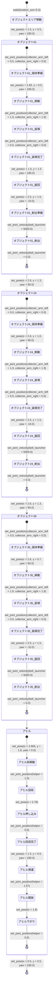

```mermaid
stateDiagram-v2
[*] --> オブジェクトエリア移動 : wait(duration_sec=5.0)
オブジェクトエリア移動 --> オブジェクト01 : set_pose(x = 1.5, y = 0.5, yaw = 180.0)
オブジェクト01 --> オブジェクト24 : set_pose(x = 2.6, y = 1.3, yaw = 90.0)
オブジェクト24 --> オブジェクト35 : set_pose(x = 2.6, y = 1.3, yaw = 90.0)
オブジェクト35 --> アヒル
アヒル --> [*] : set_pose(x = 0.5, y = 0.5, yaw = 180.0)

state オブジェクト01 {
    [*] --> オブジェクト01_保持準備 :  set_joint_position(collector_arm_left = 0.0, collector_arm_right = 0.0)
    オブジェクト01_保持準備 --> オブジェクト01_移動 : set_pose(x = 1.65, y = 0.5, yaw = 180.0)
    オブジェクト01_移動 --> オブジェクト01_装填 : set_joint_position(collector_arm_left = 1.9, collector_arm_right = 1.9)
    オブジェクト01_装填 --> オブジェクト01_装填完了 : set_joint_position(collector_arm_left = 0.0, collector_arm_right = 0.0)
    オブジェクト01_装填完了 --> オブジェクト01_旋回 : set_pose(x = 1.5, y = 1.5 yaw = 180.0)
    オブジェクト01_旋回 --> オブジェクト01_射出準備 : set_pose(x = 2.5, y = 1.5, yaw = -10.0)
    オブジェクト01_射出準備 --> オブジェクト01_射出 : set_joint_velocity(belt_launcher = 5000.0)
    オブジェクト01_射出 --> [*] : set_joint_velocity(belt_launcher = 0.0)
}

state オブジェクト24 {
    [*] --> オブジェクト24_保持準備 :  set_joint_position(collector_arm_left = 0.0, collector_arm_right = 0.0)
    オブジェクト24_保持準備 --> オブジェクト24_移動 : set_pose(x = 2.6, y = 1.0, yaw = 90.0)
    オブジェクト24_移動 --> オブジェクト24_装填 : set_joint_position(collector_arm_left = 1.9, collector_arm_right = 1.9)
    オブジェクト24_装填 --> オブジェクト24_装填完了 : set_joint_position(collector_arm_left = 0.0, collector_arm_right = 0.0)
    オブジェクト24_装填完了 --> オブジェクト24_旋回 : set_pose(x = 2.5, y = 1.5, yaw = -10.0)
    オブジェクト24_旋回 --> オブジェクト24_射出 : set_joint_velocity(belt_launcher = 5000.0)
    オブジェクト24_射出 --> [*] : set_joint_velocity(belt_launcher = 0.0)
}

state オブジェクト35 {
    [*] --> オブジェクト35_保持準備 :  set_joint_position(collector_arm_left = 0.0, collector_arm_right = 0.0)
    オブジェクト35_保持準備 --> オブジェクト35_移動 : set_pose(x = 2.6, y = 0.7, yaw = 90.0)
    オブジェクト35_移動 --> オブジェクト35_装填 : set_joint_position(collector_arm_left = 1.9, collector_arm_right = 1.9)
    オブジェクト35_装填 --> オブジェクト35_装填完了 : set_joint_position(collector_arm_left = 0.0, collector_arm_right = 0.0)
    オブジェクト35_装填完了 --> オブジェクト35_旋回 : set_pose(x = 2.5, y = 1.5, yaw = -10.0)
    オブジェクト35_旋回 --> オブジェクト35_射出 : set_joint_velocity(belt_launcher = 5000.0)
    オブジェクト35_射出 --> [*] : set_joint_velocity(belt_launcher = 0.0)
}

state アヒル {
    [*] --> アヒル前移動 : set_pose(x = 2.665, y = 1.8, yaw = 0.0)
    アヒル前移動 --> アヒル回収 : set_joint_position(helper = 1.3)
    アヒル回収 --> アヒル押し込み : set_pose(x = 2.78)
    アヒル押し込み --> アヒル回収完了 : set_joint_position(helper = 0.0)
    アヒル回収完了 --> アヒル帰還 : set_pose(x = 1.5, y = 0.5, yaw = 180.0)
    アヒル帰還 --> アヒル開放 : set_joint_position(helper = 1.57)
    アヒル開放 --> アヒル下がり : set_pose(x = 1.8)
    アヒル下がり --> [*] : set_joint_position(helper = 0.0)
}
```