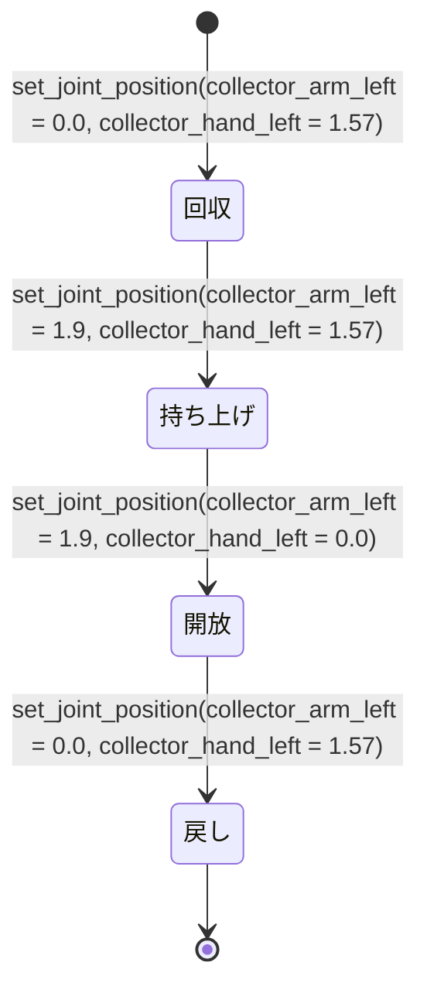

```mermaid
stateDiagram-v2
[*] --> 回収 : set_joint_position(collector_arm_left = 0.0, collector_hand_left = 1.57)
回収 --> 持ち上げ : set_joint_position(collector_arm_left = 1.9, collector_hand_left = 1.57)
持ち上げ --> 開放 : set_joint_position(collector_arm_left = 1.9, collector_hand_left = 0.0)
開放 --> 戻し : set_joint_position(collector_arm_left = 0.0, collector_hand_left = 1.57)
戻し --> [*]
```