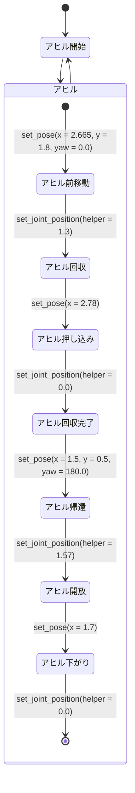

```mermaid
stateDiagram-v2
[*] --> アヒル開始
アヒル開始 --> アヒル
アヒル --> アヒル開始

state アヒル {
    [*] --> アヒル前移動 : set_pose(x = 2.665, y = 1.8, yaw = 0.0)
    アヒル前移動 --> アヒル回収 : set_joint_position(helper = 1.3)
    アヒル回収 --> アヒル押し込み : set_pose(x = 2.78)
    アヒル押し込み --> アヒル回収完了 : set_joint_position(helper = 0.0)
    アヒル回収完了 --> アヒル帰還 : set_pose(x = 1.5, y = 0.5, yaw = 180.0)
    アヒル帰還 --> アヒル開放 : set_joint_position(helper = 1.57)
    アヒル開放 --> アヒル下がり : set_pose(x = 1.7)
    アヒル下がり --> [*] : set_joint_position(helper = 0.0)
}
```