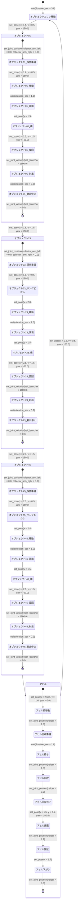

```mermaid
stateDiagram-v2
[*] --> オブジェクトエリア移動 : wait(duration_sec = 3.0)
オブジェクトエリア移動 --> オブジェクト01 : set_pose(x = 1.5, y = 0.5, yaw = 180.0)
オブジェクト01 --> オブジェクト23 : set_pose(x = 1.8, y = 1.5, yaw = 180.0)
オブジェクト23 --> オブジェクト45 : set_pose(x = 2.3, y = 1.5, yaw = 180.0)
オブジェクト45 --> アヒル
アヒル --> オブジェクトエリア移動 : set_pose(x = 0.5, y = 0.5, yaw = 180.0)

state オブジェクト01 {
    [*] --> オブジェクト01_保持準備 :  set_joint_position(collector_arm_left = 0.0, collector_arm_right = 0.0)
    オブジェクト01_保持準備 --> オブジェクト01_移動 : set_pose(x = 1.6, y = 0.5, yaw = 180.0)
    オブジェクト01_移動 --> オブジェクト01_装填 : wait(duration_sec = 1.0)
    オブジェクト01_装填 --> オブジェクト01_横 : set_pose(y = 1.5)
    オブジェクト01_横 --> オブジェクト01_旋回 : set_pose(x = 2.5, y = 1.5, yaw = -20.0)
    オブジェクト01_旋回 --> オブジェクト01_射出 : set_joint_velocity(belt_launcher = 1600.0)
    オブジェクト01_射出 --> オブジェクト01_射出停止 : wait(duration_sec = 0.2)
    オブジェクト01_射出停止 --> [*] : set_joint_velocity(belt_launcher = 0.0)
}

state オブジェクト23 {
    [*] --> オブジェクト23_保持準備 :  set_joint_position(collector_arm_left = 0.0, collector_arm_right = 0.0)
    オブジェクト23_保持準備 --> オブジェクト23_リングどかし : set_pose(x = 1.9, y = 0.5, yaw = 180.0)
    オブジェクト23_リングどかし --> オブジェクト23_移動 : set_pose(x = 2.0)
    オブジェクト23_移動 --> オブジェクト23_装填 : wait(duration_sec = 1.0)
    オブジェクト23_装填 --> オブジェクト23_横 : set_pose(y = 1.5)
    オブジェクト23_横 --> オブジェクト23_旋回 : set_pose(x = 2.5, y = 1.5, yaw = -20.0)
    オブジェクト23_旋回 --> オブジェクト23_射出 : set_joint_velocity(belt_launcher = 1600.0)
    オブジェクト23_射出 --> オブジェクト23_射出停止 : wait(duration_sec = 0.2)
    オブジェクト23_射出停止 --> [*] : set_joint_velocity(belt_launcher = 0.0)
}

state オブジェクト45 {
    [*] --> オブジェクト45_保持準備 :  set_joint_position(collector_arm_left = 0.0, collector_arm_right = 0.0)
    オブジェクト45_保持準備 --> オブジェクト45_リングどかし : set_pose(x = 2.3, y = 0.5, yaw = 180.0)
    オブジェクト45_リングどかし --> オブジェクト45_移動 : set_pose(x = 2.4)
    オブジェクト45_移動 --> オブジェクト45_装填 : wait(duration_sec = 1.0)
    オブジェクト45_装填 --> オブジェクト45_横 : set_pose(y = 1.5)
    オブジェクト45_横 --> オブジェクト45_旋回 : set_pose(x = 2.5, y = 1.5, yaw = -20.0)
    オブジェクト45_旋回 --> オブジェクト45_射出 : set_joint_velocity(belt_launcher = 1600.0)
    オブジェクト45_射出 --> オブジェクト45_射出停止 : wait(duration_sec = 0.2)
    オブジェクト45_射出停止 --> [*] : set_joint_velocity(belt_launcher = 0.0)
}

state アヒル {
    [*] --> アヒル前移動 : set_pose(x = 2.665, y = 1.6, yaw = 0.0)
    アヒル前移動  --> アヒル回収準備 : set_joint_position(helper = 1.0)
    アヒル回収準備 --> アヒル待ち : wait(duration_sec = 1.0)
    アヒル待ち --> アヒル回収 : set_joint_position(helper = 1.3)
    アヒル回収 --> アヒル回収完了 : set_joint_position(helper = 0.0)
    アヒル回収完了 --> アヒル帰還 : set_pose(x = 1.5, y = 0.5, yaw = 180.0)
    アヒル帰還 --> アヒル開放 : set_joint_position(helper = 1.7)
    アヒル開放 --> アヒル下がり : set_pose(x = 1.7)
    アヒル下がり --> [*] : set_joint_position(helper = 0.0)
}
```