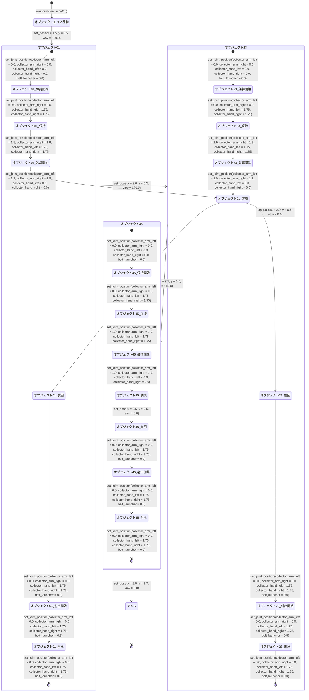

```mermaid
stateDiagram-v2
[*] --> オブジェクトエリア移動 : wait(duration_sec=2.0)
オブジェクトエリア移動 --> オブジェクト01 : set_pose(x = 1.5, y = 0.5, yaw = 180.0)
オブジェクト01 --> オブジェクト23 : set_pose(x = 2.0, y = 0.5, yaw = 180.0)
オブジェクト23 --> オブジェクト45 : set_pose(x = 2.5, y = 0.5, yaw = 180.0)
オブジェクト45 --> アヒル : set_pose(x = 2.5, y = 1.7, yaw = 0.0)
アヒル --> [*]

state オブジェクト01 {
    [*] --> オブジェクト01_保持開始 : set_joint_position(collector_arm_left = 0.0, collector_arm_right = 0.0, collector_hand_left = 0.0, collector_hand_right = 0.0, belt_launcher = 0.0)
    オブジェクト01_保持開始 --> オブジェクト01_保持 : set_joint_position(collector_arm_left = 0.0, collector_arm_right = 0.0, collector_hand_left = 1.75, collector_hand_right = 1.75)
    オブジェクト01_保持 --> オブジェクト01_装填開始 : set_joint_position(collector_arm_left = 1.9, collector_arm_right = 1.9, collector_hand_left = 1.75, collector_hand_right = 1.75)
    オブジェクト01_装填開始 --> オブジェクト01_装填 : set_joint_position(collector_arm_left = 1.9, collector_arm_right = 1.9, collector_hand_left = 0.0, collector_hand_right = 0.0)
    オブジェクト01_装填 --> オブジェクト01_旋回 : set_pose(x = 1.5, y = 0.5, yaw = 0.0)
    オブジェクト01_旋回 --> オブジェクト01_射出開始 : set_joint_position(collector_arm_left = 0.0, collector_arm_right = 0.0, collector_hand_left = 1.75, collector_hand_right = 1.75, belt_launcher = 0.0)
    オブジェクト01_射出開始 --> オブジェクト01_射出 : set_joint_position(collector_arm_left = 0.0, collector_arm_right = 0.0, collector_hand_left = 1.75, collector_hand_right = 1.75, belt_launcher = 0.5)
    オブジェクト01_射出 --> [*] : set_joint_position(collector_arm_left = 0.0, collector_arm_right = 0.0, collector_hand_left = 1.75, collector_hand_right = 1.75, belt_launcher = 0.0)
}

state オブジェクト23 {
    [*] --> オブジェクト23_保持開始 : set_joint_position(collector_arm_left = 0.0, collector_arm_right = 0.0, collector_hand_left = 0.0, collector_hand_right = 0.0, belt_launcher = 0.0)
    オブジェクト23_保持開始 --> オブジェクト23_保持 : set_joint_position(collector_arm_left = 0.0, collector_arm_right = 0.0, collector_hand_left = 1.75, collector_hand_right = 1.75)
    オブジェクト23_保持 --> オブジェクト23_装填開始 : set_joint_position(collector_arm_left = 1.9, collector_arm_right = 1.9, collector_hand_left = 1.75, collector_hand_right = 1.75)
    オブジェクト23_装填開始 --> オブジェクト01_装填 : set_joint_position(collector_arm_left = 1.9, collector_arm_right = 1.9, collector_hand_left = 0.0, collector_hand_right = 0.0)
    オブジェクト01_装填 --> オブジェクト23_旋回 : set_pose(x = 2.0, y = 0.5, yaw = 0.0)
    オブジェクト23_旋回 --> オブジェクト23_射出開始 : set_joint_position(collector_arm_left = 0.0, collector_arm_right = 0.0, collector_hand_left = 1.75, collector_hand_right = 1.75, belt_launcher = 0.0)
    オブジェクト23_射出開始 --> オブジェクト23_射出 : set_joint_position(collector_arm_left = 0.0, collector_arm_right = 0.0, collector_hand_left = 1.75, collector_hand_right = 1.75, belt_launcher = 0.5)
    オブジェクト23_射出 --> [*] : set_joint_position(collector_arm_left = 0.0, collector_arm_right = 0.0, collector_hand_left = 1.75, collector_hand_right = 1.75, belt_launcher = 0.0)
}

state オブジェクト45 {
    [*] --> オブジェクト45_保持開始 : set_joint_position(collector_arm_left = 0.0, collector_arm_right = 0.0, collector_hand_left = 0.0, collector_hand_right = 0.0, belt_launcher = 0.0)
    オブジェクト45_保持開始 --> オブジェクト45_保持 : set_joint_position(collector_arm_left = 0.0, collector_arm_right = 0.0, collector_hand_left = 1.75, collector_hand_right = 1.75)
    オブジェクト45_保持 --> オブジェクト45_装填開始 : set_joint_position(collector_arm_left = 1.9, collector_arm_right = 1.9, collector_hand_left = 1.75, collector_hand_right = 1.75)
    オブジェクト45_装填開始 --> オブジェクト45_装填 : set_joint_position(collector_arm_left = 1.9, collector_arm_right = 1.9, collector_hand_left = 0.0, collector_hand_right = 0.0)
    オブジェクト45_装填 --> オブジェクト45_旋回 : set_pose(x = 2.5, y = 0.5, yaw = 0.0)
    オブジェクト45_旋回 --> オブジェクト45_射出開始 : set_joint_position(collector_arm_left = 0.0, collector_arm_right = 0.0, collector_hand_left = 1.75, collector_hand_right = 1.75, belt_launcher = 0.0)
    オブジェクト45_射出開始 --> オブジェクト45_射出 : set_joint_position(collector_arm_left = 0.0, collector_arm_right = 0.0, collector_hand_left = 1.75, collector_hand_right = 1.75, belt_launcher = 0.5)
    オブジェクト45_射出 --> [*] : set_joint_position(collector_arm_left = 0.0, collector_arm_right = 0.0, collector_hand_left = 1.75, collector_hand_right = 1.75, belt_launcher = 0.0)
}
```