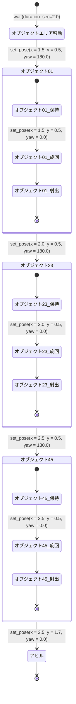

```mermaid
stateDiagram-v2
[*] --> オブジェクトエリア移動 : wait(duration_sec=2.0)
オブジェクトエリア移動 --> オブジェクト01 : set_pose(x = 1.5, y = 0.5, yaw = 180.0)
オブジェクト01 --> オブジェクト23 : set_pose(x = 2.0, y = 0.5, yaw = 180.0)
オブジェクト23 --> オブジェクト45 : set_pose(x = 2.5, y = 0.5, yaw = 180.0)
オブジェクト45 --> アヒル : set_pose(x = 2.5, y = 1.7, yaw = 0.0)
アヒル --> [*]

state オブジェクト01 {
    [*] --> オブジェクト01_保持
    オブジェクト01_保持 --> オブジェクト01_旋回 : set_pose(x = 1.5, y = 0.5, yaw = 0.0)
    オブジェクト01_旋回 --> オブジェクト01_射出
    オブジェクト01_射出 --> [*]
}

state オブジェクト23 {
    [*] --> オブジェクト23_保持
    オブジェクト23_保持 --> オブジェクト23_旋回 : set_pose(x = 2.0, y = 0.5, yaw = 0.0)
    オブジェクト23_旋回 --> オブジェクト23_射出
    オブジェクト23_射出 --> [*]
}

state オブジェクト45 {
    [*] --> オブジェクト45_保持
    オブジェクト45_保持 --> オブジェクト45_旋回 : set_pose(x = 2.5, y = 0.5, yaw = 0.0)
    オブジェクト45_旋回 --> オブジェクト45_射出
    オブジェクト45_射出 --> [*]
}
```