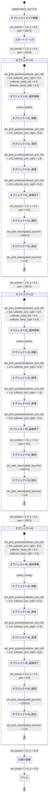

```mermaid
stateDiagram-v2
[*] --> オブジェクトエリア移動 : wait(duration_sec=2.0)
オブジェクトエリア移動 --> スタートゾーン0 : set_pose(x = 1.5, y = 0.5, yaw = 180.0)
スタートゾーン0 --> オブジェクト01 : set_pose(x = 1.5, y = 0.5, yaw = 180.0)
オブジェクト01 --> オブジェクト23 : set_pose(x = 1.9, y = 0.5, yaw = 180.0)
オブジェクト23 --> オブジェクト45 : set_pose(x = 2.3, y = 0.5, yaw = 180.0)
オブジェクト45 --> お助け装着 : set_pose(x = 0.5, y = 0.5)
お助け装着 --> アヒル : set_pose(x = 2.5, y = 2.0)
アヒル --> [*]

state オブジェクト01 {
    [*] --> オブジェクト01_保持準備 :  set_joint_position(collector_arm_left = 0.0, collector_arm_right = 0.0, collector_hand_left = 0.2, collector_hand_right = 0.2)
    オブジェクト01_保持準備 --> オブジェクト01_移動 : collect_bottle()
    オブジェクト01_移動 --> オブジェクト01_保持 : set_joint_position(collector_arm_left = 0.0, collector_arm_right = 0.0)
    オブジェクト01_保持 --> オブジェクト01_装填 : set_joint_position(collector_arm_left = 1.9, collector_arm_right = 1.9)
    オブジェクト01_装填 --> オブジェクト01_装填完了 : set_joint_position(collector_arm_left = 0.0, collector_arm_right = 0.0)
    オブジェクト01_装填完了 --> オブジェクト01_旋回 : set_pose(x = 1.5, y = 0.5, yaw = 0.0)
    オブジェクト01_旋回 --> オブジェクト01_射出 : set_joint_velocity(belt_launcher = 5000.0)
    オブジェクト01_射出 --> [*] : set_joint_velocity(belt_launcher = 0.0)
}

state オブジェクト23 {
    [*] --> オブジェクト23_保持準備 :  set_joint_position(collector_arm_left = 0.0, collector_arm_right = 0.0, collector_hand_left = 0.2, collector_hand_right = 0.2)
    オブジェクト23_保持準備 --> オブジェクト23_移動 : collect_bottle()
    オブジェクト23_移動 --> オブジェクト23_保持 : set_joint_position(collector_arm_left = 0.0, collector_arm_right = 0.0)
    オブジェクト23_保持 --> オブジェクト23_装填 : set_joint_position(collector_arm_left = 1.9, collector_arm_right = 1.9)
    オブジェクト23_装填 --> オブジェクト23_装填完了 : set_joint_position(collector_arm_left = 0.0, collector_arm_right = 0.0)
    オブジェクト23_装填完了 --> オブジェクト23_旋回 : set_pose(x = 1.9, y = 0.5, yaw = 0.0)
    オブジェクト23_旋回 --> オブジェクト23_射出 : set_joint_velocity(belt_launcher = 5000.0)
    オブジェクト23_射出 --> [*] : set_joint_velocity(belt_launcher = 0.0)
}

state オブジェクト45 {
    [*] --> オブジェクト45_保持準備 :  set_joint_position(collector_arm_left = 0.0, collector_arm_right = 0.0, collector_hand_left = 0.2, collector_hand_right = 0.2)
    オブジェクト45_保持準備 --> オブジェクト45_移動 : collect_bottle()
    オブジェクト45_移動 --> オブジェクト45_保持 : set_joint_position(collector_arm_left = 0.0, collector_arm_right = 0.0)
    オブジェクト45_保持 --> オブジェクト45_装填 : set_joint_position(collector_arm_left = 1.9, collector_arm_right = 1.9)
    オブジェクト45_装填 --> オブジェクト45_装填完了 : set_joint_position(collector_arm_left = 0.0, collector_arm_right = 0.0)
    オブジェクト45_装填完了 --> オブジェクト45_旋回 : set_pose(x = 2.3, y = 0.5, yaw = 0.0)
    オブジェクト45_旋回 --> オブジェクト45_射出 : set_joint_velocity(belt_launcher = 5000.0)
    オブジェクト45_射出 --> [*] : set_joint_velocity(belt_launcher = 0.0)
}

```